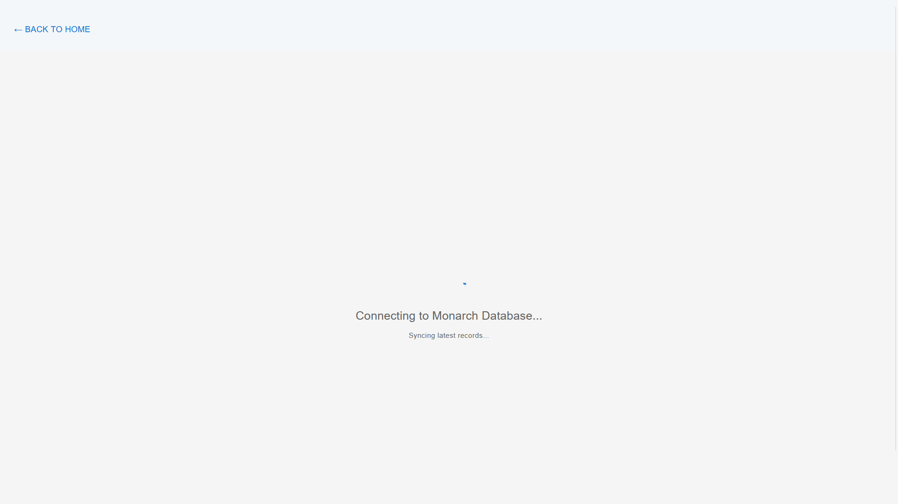
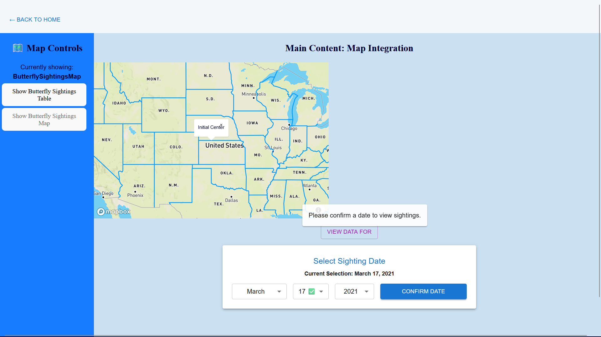
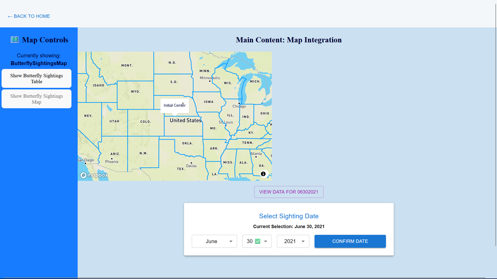
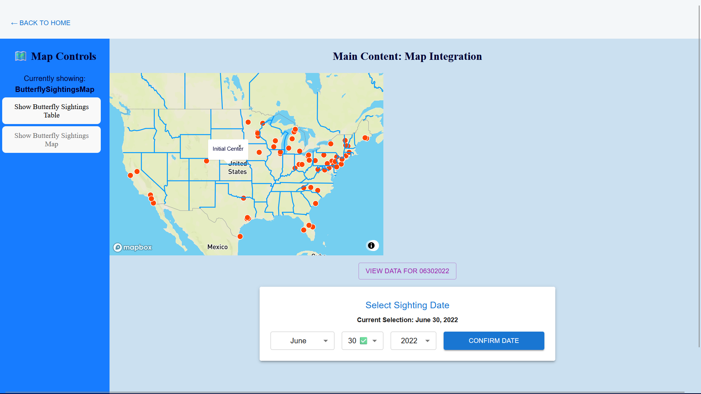
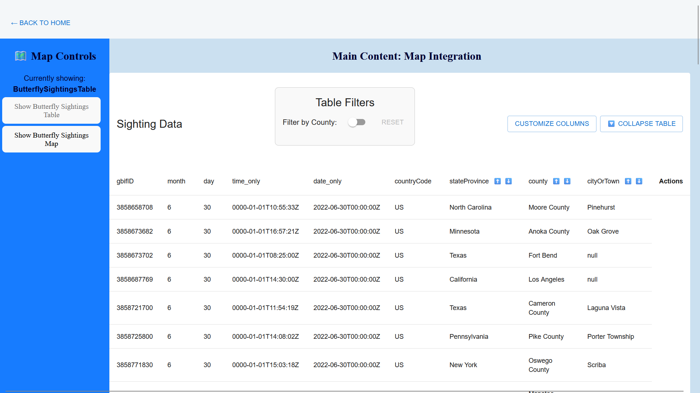
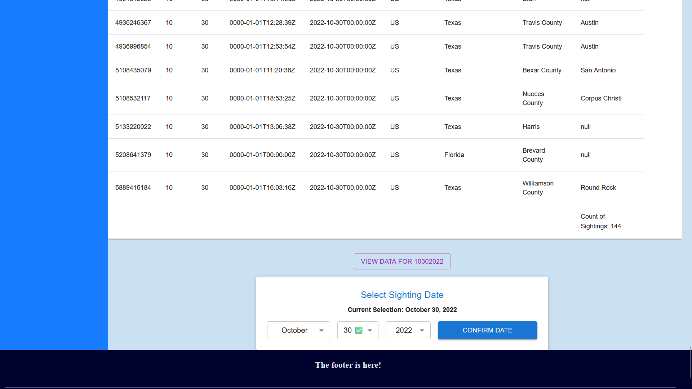

# 🦋 Monarch Migration ETL & Analytics

A full-stack data engineering project that extracts, transforms, and visualizes Monarch butterfly (_Danaus plexippus_) occurrence data from the **GBIF (Global Biodiversity Information Facility)**.

## 🚀 Overview










This project automates the collection of biodiversity data to track migration patterns. It features a Python-based ETL pipeline hosted on GitHub Actions and a React dashboard for analyzing geographical trends.

### Key Features

- **ETL**: Data extraction from GBIF using Python and `pandas`.
- **Schema Enforcement**: Strict PostgreSQL schema mapping using SQLAlchemy to handle inconsistent API responses.
- **Interactive Dashboard**: A Material UI (MUI) data table with advanced filtering, sorting, and column customization.
- **Data Integrity**: Frontend de-duplication and backend `replace` strategies to ensure 100% data accuracy.

---

## 🛠️ Tech Stack

| Layer           | Technologies                               |
| --------------- | ------------------------------------------ |
| **Frontend**    | React, TypeScript, Material UI (MUI), Vite |
| **Backend/ETL** | Python, Pandas, SQLAlchemy                 |
| **Database**    | PostgreSQL (GCP -> Digital Ocean -> Xata)  |
| **CI/CD**       | GitHub Actions                             |

---

## 🏗️ Architecture & ETL Logic

### 1. Extraction & Transformation

The Python module (`monarch_butterfly_module.py`) performs:

- **Timezone Normalization**: Converts various date formats into standardized UTC `DateTime` objects.
- **Spatial Validation**: Ensures coordinates fall within valid global ranges (Lat: -90 to 90).
- **Schema Consistency**: Maps 35+ specific GBIF fields to a consistent database structure, filling missing columns with nulls to prevent load failures.

### 2. Loading Strategy

To maintain a clean state, the loader uses an **Atomic Replace** strategy:

```python
df.to_sql(table_name, engine, if_exists='replace', dtype=dtype_mapping)

```

This ensures that any schema updates or historical data corrections are reflected immediately without creating duplicate records.

---

## 💻 Frontend Implementation

The React application uses a custom-hook architecture to separate concerns:

- `useTableFilters`: Manages complex location-based filtering (State, County, City).
- `useTableSorting`: Handles multi-directional sorting for temporal and spatial data.
- `useColumnVisibility`: Allows users to toggle between presets.

## 📊 Data Inventory

The system maintains a `data_inventory` table to track which days have been successfully processed, preventing redundant API calls and ensuring data lineage.

---

## 📝 License

Distributed under the MIT License. See `LICENSE` for more information.
